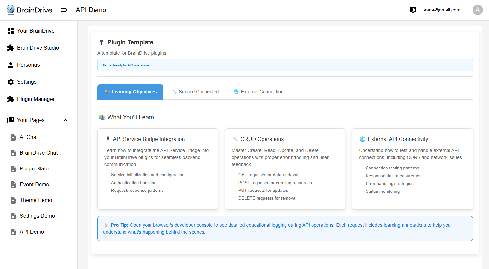

# ServiceExample_API - BrainDrive API Service Bridge Demo

A working demonstration plugin for BrainDrive's API Service Bridge functionality. This plugin showcases both internal backend CRUD operations and external API connectivity testing through an interactive tabbed interface with comprehensive error handling patterns.

## 📸 Plugin Demo



*The ServiceExample_API plugin in action, showing the three-tab interface for Learning Objectives, Service Connected operations, and External Connection testing.*

## 🎯 Purpose

This plugin serves as a **working demo** of BrainDrive's API Service Bridge, demonstrating:
- How to perform CRUD operations with BrainDrive's backend
- External API connectivity testing and monitoring
- API Service Bridge integration patterns
- Comprehensive error handling and recovery strategies
- Best practices for API operations in BrainDrive plugins

## 📦 What's Included

### Three Interactive Tabs

1. **Learning Objectives** - Educational content about API Service Bridge concepts
2. **Service Connected** - Live CRUD operations with BrainDrive backend
3. **External Connection** - External API connectivity testing and monitoring

### API Service Bridge Integration
- Complete API Service wrapper implementation
- Proper service bridge connection handling
- Authenticated requests to BrainDrive backend
- External API connectivity testing
- Comprehensive error handling and user feedback

## 🚀 Installation & Usage

### Prerequisites
- BrainDrive platform (this plugin runs inside BrainDrive)
- Plugin Manager access in BrainDrive
- BrainDrive backend with demo endpoints

### Installation
1. Install the plugin through BrainDrive's Plugin Manager
2. The plugin will be available in your module library

### Usage in BrainDrive
1. **Create a new page** in BrainDrive
2. **Add the API Demo module** to your page:
   - Drag "API Service Bridge Example" module to the page
3. **Explore the functionality**:
   - **Learning Tab**: Read about API Service Bridge concepts
   - **Service Connected Tab**: Test CRUD operations with live data
   - **External Connection Tab**: Monitor external API connectivity

## 🔧 Demo Features

### Learning Objectives Tab
- **API Service Bridge Concepts**: Understanding service integration
- **CRUD Operations Guide**: Learn Create, Read, Update, Delete patterns
- **Error Handling Education**: Comprehensive error management strategies
- **Best Practices**: Production-ready development patterns
- **External API Integration**: Connectivity testing and monitoring

### Service Connected Tab
- **Live CRUD Operations**: 
  - Create new demo items with validation
  - Read and display existing items
  - Update items with real-time feedback
  - Delete items with confirmation
- **Real-time Status**: Connection status and operation feedback
- **Error Demonstration**: See error handling in action
- **Loading States**: Proper loading indicators and state management

### External Connection Tab
- **Connectivity Testing**: Test external API endpoints
- **Response Time Monitoring**: Track API response performance
- **Connection Status**: Visual indicators for API availability
- **Error Analysis**: Detailed error categorization and recovery suggestions
- **Timeout Handling**: Demonstrate timeout and retry patterns

## 📡 API Service Bridge Demo

This plugin demonstrates key API Service Bridge concepts:

### Service Integration
```typescript
// How the API Service Bridge is initialized
if (services.api) {
  apiServiceWrapper.setServiceBridge(services.api);
  console.log('[API-DEMO] ✅ API Service Bridge connected');
}
```

### CRUD Operations
```typescript
// Create operation
const result = await demoApiService.createItem({
  name: 'Demo Item',
  description: 'A demonstration item',
  value: 42
});

// Read operation
const items = await demoApiService.getItems();

// Update operation
const updated = await demoApiService.updateItem(id, {
  name: 'Updated Item'
});

// Delete operation
await demoApiService.deleteItem(id);
```

### External API Testing
```typescript
// Test external connectivity
const result = await externalApiService.checkCommunityStatus();
console.log('External API status:', result.data.status);
```

### Error Handling
```typescript
try {
  const result = await apiService.get('/endpoint');
  // Handle success
} catch (error) {
  // Comprehensive error handling
  const userMessage = this.extractUserFriendlyMessage(error);
  this.setState({ error: userMessage });
  this.logErrorEducation(error, 'GET');
}
```

## 🎓 Learning Objectives

After using this demo, developers will understand:
- How BrainDrive's API Service Bridge works
- CRUD operation patterns with proper error handling
- External API connectivity testing techniques
- Service bridge integration best practices
- Comprehensive error handling and recovery strategies
- Loading state management and user feedback patterns

## 🧪 Testing the Demo

### Basic Test Flow
1. Place the API Demo module on a BrainDrive page
2. Navigate through the three tabs to explore functionality
3. Test CRUD operations in the Service Connected tab
4. Monitor external API connectivity in the External Connection tab
5. Observe error handling by testing with invalid data or network issues

### Advanced Testing
- Test error scenarios by disconnecting from the internet
- Try creating items with invalid data to see validation errors
- Monitor the browser console for educational logging
- Test the external API connectivity with different endpoints
- Observe loading states and error recovery patterns

## 🔍 Technical Implementation

### Module Federation Architecture
- Class-based React components for BrainDrive compatibility
- Proper webpack configuration for plugin loading
- Service bridge integration following BrainDrive patterns
- Comprehensive TypeScript type definitions

### API Data Structures
```typescript
interface DemoItem {
  id: string;              // Unique identifier
  name: string;            // Display name
  description: string;     // Item description
  value: number;           // Numeric value
  timestamp: string;       // ISO timestamp
}

interface ApiResponse<T = any> {
  success: boolean;        // Operation success status
  data?: T;               // Response data
  error?: string;         // Error message
  message?: string;       // Success message
}
```

### Component Architecture
- Tabbed interface with three distinct sections
- Service layer abstraction for API operations
- Comprehensive error handling and user feedback
- Educational logging for learning purposes

## 🛠️ For Developers

This plugin serves as a **reference implementation** for:
- API Service Bridge integration
- CRUD operation patterns
- External API connectivity testing
- Comprehensive error handling strategies
- BrainDrive plugin architecture

### Key Files
- `src/services/apiService.ts` - API Service Bridge wrapper
- `src/services/demoApiService.ts` - CRUD operations service
- `src/services/externalApiService.ts` - External API testing service
- `src/ApiExample.tsx` - Main component with tabbed interface
- `src/components/` - Individual demo components

## 📋 Requirements

- **BrainDrive Platform**: This plugin must run inside BrainDrive
- **API Service**: Requires BrainDrive's API Service to be available
- **Backend Endpoints**: Demo endpoints must be available in BrainDrive backend
- **Internet Connection**: Required for external API connectivity testing

## 🆘 Troubleshooting

### Common Issues
- **API Service not connected**: Ensure API Service is available in BrainDrive
- **CRUD operations failing**: Check backend demo endpoints are running
- **External API tests failing**: Verify internet connection and external service availability
- **Loading states stuck**: Check browser console for error details

### Debug Tips
- Check browser console for detailed API Service logs
- Use the educational logging to understand error patterns
- Monitor network tab in browser dev tools for request details
- Verify API Service Bridge initialization in console logs

### Error Categories
- **Network Errors**: Connection issues, timeouts, DNS problems
- **Authentication Errors**: Token expiration, permission issues
- **Validation Errors**: Invalid input data, missing required fields
- **Server Errors**: Backend service issues, database problems

## 🎯 Error Handling Features

### Comprehensive Error Patterns
- **User-Friendly Messages**: Technical errors translated to understandable language
- **Error Categorization**: Network, authentication, validation, and server errors
- **Recovery Suggestions**: Specific guidance for different error types
- **Educational Logging**: Detailed error analysis for learning purposes

### Error Recovery Strategies
- **Automatic Retries**: For transient network errors
- **User Guidance**: Clear instructions for resolving issues
- **Graceful Degradation**: Fallback behaviors when services unavailable
- **State Management**: Proper cleanup and loading state handling

## 📚 Related Links

- [BrainDrive](https://github.com/BrainDriveAI/BrainDrive)
- [Service Bridge - API Developers Guide](DEVELOPER_GUIDE.md)

---

**Experience BrainDrive's API Service Bridge in Action! 🔌**

*This is a demonstration plugin designed to run within the BrainDrive platform. It showcases comprehensive API integration capabilities with robust error handling patterns.*